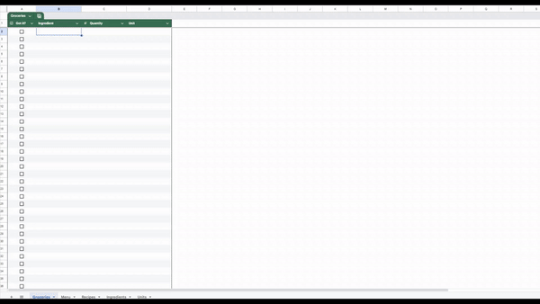

# Meal Prep Groceries

A quick and efficient solution to manage groceries for meal prepping, built using Google Sheets and Apps Script. This project automates the process of managing ingredient units, recipes, and grocery lists, making meal prep easier and more organized.

## Features

### Google Sheets Overview

1. **Units Sheet**  
   - Contains supported units of measurement:  
     - Mass (e.g., g, kg, lb, etc.)  
     - Volume (e.g., ml, l, etc.)  
     - Unit (e.g., "one unit of")  

2. **Ingredients Sheet**  
   - Lists all possible ingredients for recipes.  
   - Includes density information for some ingredients (to handle conversions like "2 cups of oats" to "200g of oats").  
   - Stores the preferred unit for each ingredient.

3. **Recipes Sheet**  
   - Stores all recipes following a strict column pattern:  
     - Recipes must consistently use the same relative cell positions for macro stats and ingredient lists.  
     - Columns follow groupings (e.g., B-F, H-L, N-R).  
   - Recipes with proper formatting auto-populate the **Menu Sheet**.

4. **Menu Sheet**  
   - Acts as a weekly meal plan interface.  
   - Select recipes and number of servings for each.  
   - Automatically generates a **Groceries Sheet**.

5. **Groceries Sheet**  
   - Fully automated list of groceries based on the menu selections.  
   - Displays correct quantities in preferred units for each ingredient.  
   - Allows users to check off items as they add them to their cart.

### Automation with Apps Script

- **Setup**  
  1. Open the Google Sheet.  
  2. Go to **Extensions** > **Apps Script**.  
  3. Paste the script code from the repository into the editor.  
  4. Save the script.

- **Add a Trigger**  
  1. In the Apps Script window, click on the clock icon in the sidebar.  
  2. Click **Add Trigger**.  
  3. Configure the trigger:  
     - Function to run: `main`  
     - Event source: `Spreadsheet`  
     - Event type: `On edit`  
     - Notification frequency: Choose based on your preference.  

     > *Note:* Notifications can be disabled by wrapping the `main` function in a `try-catch` block. Remove this if you'd like error notifications.  

  4. Save the trigger.

## How It Works

1. Populate the **Recipes Sheet** with your recipes.  
2. Configure your weekly menu in the **Menu Sheet**.  
3. The script auto-generates the **Groceries Sheet** with quantities in the preferred units.  
4. Check off ingredients as you shop.

## Contributing

This project is tailored for personal use but can be adapted for broader purposes. Contributions to improve its functionality or documentation are welcome.

## License

This project is open-source under the [MIT License](LICENSE). Feel free to use, modify, and share as you wish.